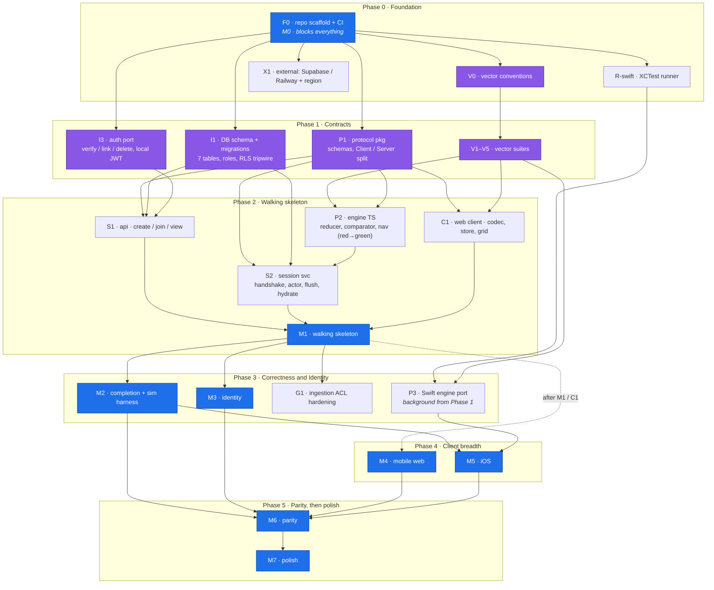

# Crossy v4 Roadmap

Execution plan for the design in `DESIGN.md` and the wire contract in `PROTOCOL.md`.
Phases are sequential; waves within a phase are parallel tracks, each sized to be one
agent's self-contained, PR-able unit. Exit criteria are observable and mostly verbatim
from DESIGN.md §13, which stays canonical for milestone (M0–M7) definitions.

Multiple agents merge into main concurrently (see `CLAUDE.md`). The ordering rule that
makes that safe: **contracts land before implementations** — `vectors/`,
`packages/protocol`, and the DB schema are the coordination surfaces, so they merge
first and change only via small, reviewed PRs. `apps/*` directories are effectively
single-owner per wave and can move fast.

## Dependency graph

Load-bearing sequential edges (cannot be parallelized away):

1. Scaffold before anything.
2. Vector conventions before vector suites (one file format, two runners).
3. Vectors before engine implementation — the spec is the failing test (DESIGN.md §11).
4. Protocol package before both services and both clients.
5. api + session + web all exist before M1 integration.
6. M1 before M2 (completion and the simulation harness need a working actor pipeline).
7. M2 before M5/M6 (iOS conforms to a server whose behavior has stopped moving).

Open decision to record in Phase 1: whether `packages/engine` imports types from
`packages/protocol` or defines its own domain types with the session adapter mapping
between them. Leaning dependency-free engine (purity, symmetry with the Swift port);
vectors pin both sides against drift. Decide once, in writing, in the PR that starts P2.

## UX track (cross-cutting)

Most of the product risk after M1 sits in client look and feel: grid rendering,
keyboard and touch input, presence motion, mobile ergonomics, native iOS polish.
Vectors cannot pin feel, so UX runs as a background track alongside the correctness
spine, the way the Swift port does:

- **Starts in Phase 1** (Wave 1.1 track h): an interaction playground in `apps/web` on
  fake data, no server. Grid rendering per DESIGN.md §10, input handling driven by the
  navigation vectors, flash and cursor motion prototypes. Findings shape the Wave 2.1d
  store and grid before they are built for real.
- **Flesh-out gates.** The client sections below (Wave 2.1d, Phase 4 both tracks,
  Phase 5) are deliberately thin. At entry to each, expand it into a concrete
  interaction spec: screens, input edge cases, motion timings, layout. The spec lands
  as a PR against this file, and against DESIGN.md §10 where the rule is durable.
  Building before the spec exists is the failure mode this gate blocks.
- **Dogfood at every client milestone exit.** A real solve, real puzzle, real friends,
  real devices. Feel findings become vectors where possible (navigation, store) and
  spec updates where not (motion, layout).
- **Web settles semantics before iOS renders them.** By M5 every shared interaction
  rule is vectored and proven in the web client, so iOS effort goes to rendering
  quality and platform feel, which is why the app is native at all.

## Phase 0 — Foundation (= M0)

### Wave 0.1 — repo scaffold (single agent, sequential) — DONE

- [x] Docs at root as `DESIGN.md` / `PROTOCOL.md`; references resolve
- [x] pnpm workspace: `packages/engine`, `packages/protocol`, `apps/api`, `apps/session`,
      `apps/web`, `apps/ios`, `vectors/`, `reports/`
- [x] Base tsconfig, eslint, prettier, vitest wiring
- [x] Boundary enforcement (dependency-cruiser): engine imports nothing, protocol imports
      no workspace code, apps never import each other, packages never import apps
- [x] CI: lint + boundaries + typecheck + unit on every push
- [x] `CLAUDE.md` conventions for multi-agent work
- [x] This file

**Exit: fresh clone → `pnpm install && pnpm lint && pnpm typecheck && pnpm test` green in CI.**
(Fresh-clone reproducibility is a launch gate; it starts true and stays true.)

### Wave 0.2 — three parallel tracks

- [ ] **a. Vector harness**: `vectors/` conventions (file naming, case shape, runner
      discovery) + vitest runner in `packages/engine` + one deliberately failing
      reducer vector
- [ ] **b. Swift runner**: minimal Swift package under `apps/ios` + XCTest runner
      consuming the same JSON + macOS CI job path-filtered to `apps/ios/**` and
      `vectors/**`
- [ ] **c. Postgres wiring**: Drizzle Kit + an empty migration applied by a
      Testcontainers CI job; create the Supabase project and choose the region
      (closes the region open question, DESIGN.md §15)

**Exit (= M0): a red vector fails CI in both TypeScript and Swift; Testcontainers wired.**

## Phase 1 — Contracts (the fan-out enabler)

### Wave 1.1 — up to seven parallel tracks, all depending only on Phase 0

| Track | Work                                                                                                                                                             | Unblocks        |
| ----- | ---------------------------------------------------------------------------------------------------------------------------------------------------------------- | --------------- |
| a     | `packages/protocol`: every message schema from PROTOCOL.md §§2–6, `ServerPuzzle`/`ClientPuzzle` split (INV-6), error codes, contract snapshot tests              | S1, S2, C1      |
| b     | Reducer vectors: no-ops, overwrites, ASCII normalization (incl. Turkish-İ), `firstFillAt`, seq assignment                                                        | P2              |
| c     | Comparator + completion-matrix vectors: full/first-char/case acceptance, level-triggered re-check, exactly-one-completion                                        | P2, M2          |
| d     | Navigation vectors: the 12 seed cases (PROTOCOL.md §13) + planned additions (word bounds, Tab, typing wrap, backspace)                                           | P2, C1          |
| e     | Client-store vectors: overlay echo, error-clears-overlay, gap→sync, snapshot reconciliation, crash rollback                                                      | C1, C2          |
| f     | DB schema + migrations: all seven tables (DESIGN.md §9), least-privilege roles per service, RLS deny-all tripwire                                                | S1, S2          |
| g     | Auth port: interface, Supabase adapter with local JWT verification, in-memory fake for tests                                                                     | S1              |
| h     | UX playground: Vite scaffold in `apps/web` with a grid interaction prototype on fake data (rendering rules DESIGN.md §10, navigation vectors as the input model) | C1, M4/M5 specs |

**Exit: all vector suites committed and parsed by both runners (red is fine —
unimplemented is the point); protocol package compiles with snapshot tests green;
migrations apply cleanly on Testcontainers; the engine/protocol type decision recorded.**

## Phase 2 — Walking skeleton (= M1)

### Wave 2.1 — four parallel tracks

| Track | Work                                                                                                                                       |
| ----- | ------------------------------------------------------------------------------------------------------------------------------------------ |
| a     | `packages/engine` TS: reducer, comparator, navigation — Phase 1 vectors red → green                                                        |
| b     | `apps/api` slice: `POST /puzzles` (happy-path fixture ingest only), `POST /games` + invite codes, join, `GET /games/{id}`, JIT user upsert |
| c     | `apps/session`: handshake (PROTOCOL.md §2), actor mailbox, hydrate, `placeLetter` → `cellSet` broadcast                                    |
| d     | `apps/web` skeleton: WS codec, store + connection state machine driven by client-store vectors, minimal SVG grid                           |

Track d has a UX flesh-out gate (see the UX track): the desktop interaction spec, grid
input and selection, is written before the store and grid are built, and the Wave 1.1h
playground is the base it builds on.

### Wave 2.2 — integration (sequential; needs all of 2.1)

Write-behind flush (~25 events / ~5 s, one transaction with the snapshot), reconnect
resync via full snapshot, SIGTERM drain, Playwright smoke, deploy both services to
Railway (validates the WebSocket + private-network open questions, DESIGN.md §15).

**Exit (= M1): two browsers converge after one is killed mid-word; flush atomicity and
rehydrate proven under Testcontainers; the `/internal` private-network assumption
confirmed on Railway.**

## Phase 3 — Correctness core ∥ Identity (= M2 ∥ M3)

- **Track A (M2)**: level-triggered two-phase completion, synchronous terminal flush,
  derived timer, confetti, completion matrix green end-to-end, simulation harness
  (fast-check, seeded) first green run. Tune flush/passivation thresholds with
  measurement. **Exit: a full solve celebrates once, and only once, on both clients;
  harness failures reproduce from a seed number.**
- **Track B (M3)**: Apple + Discord + guest auth, role upgrade, kick with denylist +
  `membership-changed` internal endpoint, abandon with hydrate-on-demand, host
  succession, tombstone deletion. **Exit: a guest joins from a fresh phone, upgrades,
  keeps history; a kicked account finds the link dead.**
- **Track C (background)**: Swift engine port toward green; full ingestion ACL (all
  named rejections, solvability check, 25×25 cap).

The one shared seam is the session service's connect-time membership check — a
published contract (DESIGN.md §9), not a free-edit surface.

## Phase 4 — Client breadth (= M4 ∥ M5)

**This phase is where the product is won or lost, and these sections are deliberately
thin.** UX flesh-out gate at entry for both tracks: expand each into a full interaction
spec (see the UX track) before building. Budget for iteration here; the milestones
before this one exist so this phase can afford it.

- **Track A (M4)**: mobile web — clue bar, bottom-sheet browser, on-screen keyboard,
  swipes. Flesh-out covers at minimum: touch targets and thumb reach, keyboard layout
  and rebus entry, sheet gestures vs solving gestures, safe areas, landscape.
  **Exit: a phone-only friend solves comfortably, observed in a dogfood session.**
- **Track B (M5)**: iOS — Swift vectors fully green, handshake, Canvas grid renderer,
  native Sign in with Apple, universal links. Verify iOS 26 / Liquid Glass assumptions
  against current SDKs at kickoff. Flesh-out covers at minimum: Canvas render spec
  matching the web grid rules, haptics, hardware keyboard, Dynamic Type on chrome,
  scenePhase reconnect. **Exit: an iOS user and a web user finish a puzzle together,
  observed in a dogfood session.**

## Phase 5 — Parity, then polish (= M6 → M7, sequential)

UX flesh-out gate at entry: M6 items are interaction surfaces (rebus entry, check
styling, highlight precedence), not just mechanics. Spec them per platform first.

- **M6**: check styling, rebus input on both platforms, cross-reference highlighting,
  circles/shading, image clues; validate the rebus length-10 cap against real puzzles.
  **Exit: the v2 parity checklist is green.**
- **M7**: OG preview images (geometry only, never fills), passivation tuning, presence
  colors everywhere, nightly simulation runs. **Exit: a link pasted in Discord unfurls
  with the grid image.**
