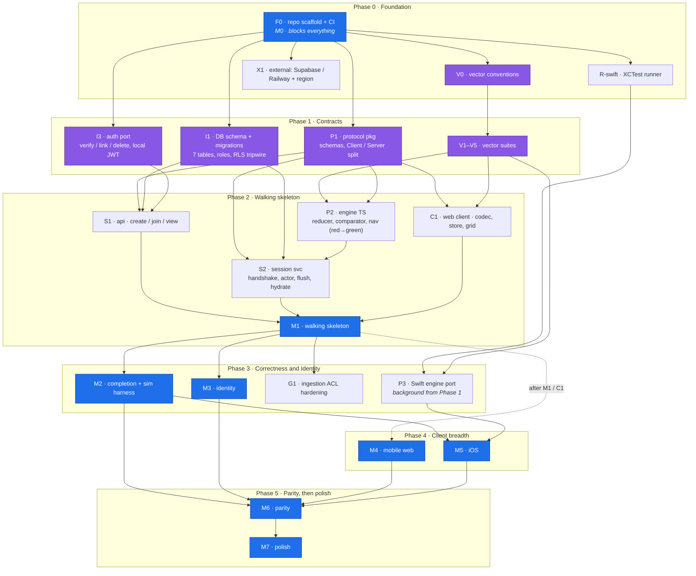

# Crossy v4 Roadmap

Execution plan for the design in `DESIGN.md` and the wire contract in `PROTOCOL.md`.
Phases are sequential; waves within a phase are parallel tracks, each sized to be one
agent's self-contained, PR-able unit. Exit criteria are observable and mostly verbatim
from DESIGN.md §13, which stays canonical for milestone (M0–M7) definitions.

Multiple agents merge into main concurrently (see `CLAUDE.md`). The ordering rule that
makes that safe: **contracts land before implementations** — `vectors/`,
`packages/protocol`, and the DB schema are the coordination surfaces, so they merge
first and change only via small, reviewed PRs. `apps/*` directories are effectively
single-owner per wave and can move fast.

## Dependency graph

Load-bearing sequential edges (cannot be parallelized away):

1. Scaffold before anything.
2. Vector conventions before vector suites (one file format, two runners).
3. Vectors before engine implementation — the spec is the failing test (DESIGN.md §11).
4. Protocol package before both services and both clients.
5. api + session + web all exist before M1 integration.
6. M1 before M2 (completion and the simulation harness need a working actor pipeline).
7. M2 before M5/M6 (iOS conforms to a server whose behavior has stopped moving).

Open decision to record in Phase 1: whether `packages/engine` imports types from
`packages/protocol` or defines its own domain types with the session adapter mapping
between them. Leaning dependency-free engine (purity, symmetry with the Swift port);
vectors pin both sides against drift. Decide once, in writing, in the PR that starts P2.

## Spike track (close technical unknowns before building on them)

DESIGN.md §15 is the uncertainty register. Some entries are tune-with-measurement and
stay at their assigned milestones (flush thresholds, passivation delay). The rest are
answerable now for a day or less of throwaway work each, and several would invalidate
design decisions if the answer surprises us. Those get spiked during Phase 0 and
Phase 1, before anything substantial is built on top of them.

Rules: every spike is timeboxed; spike code is throwaway and never merges. The merged
artifact is a short written answer in `reports/spikes/`, plus an update to DESIGN.md
(§14/§15) where it changes a decision. A build track does not start while a spike it
depends on is open.

- [x] **SP1 Guest upgrade keeps `user_id`** (half day). Supabase anonymous sign-in,
      then link Apple or Discord: same UUID before and after? D09's "everything keys
      on `user_id`" axiom rests on this. If it fails, guest identity needs a redesign
      before M3, not during it. Blocks: 1.1g design, M3.
      Answered yes; see `reports/spikes/sp1-guest-upgrade-keeps-user-id.md`. D09
      stands. Collision cases (email or OAuth identity already owned) fail closed
      and are a sign-in, not a merge; M3 handles them as product scope.
- [x] **SP2 Local JWT verification** (half day). Verify Supabase access tokens against
      published keys with zero per-request network calls: JWKS shape, key rotation,
      the anonymous claim. Blocks: 1.1g.
      Answered yes; see `reports/spikes/sp2-local-jwt-verification.md`. New projects
      sign user tokens with asymmetric ES256 and publish a JWKS; a background refresh
      into an in-memory `jose` key set verifies every token offline. `sub` and
      `is_anonymous` are present as SP1 assumed. D05/§8 hold unchanged. 1.1g unblocked.
- [x] **SP3 Railway reality check** (one day). Toy WS echo service deployed in the
      two-service shape: idle socket timeouts, `permessage-deflate` pass-through,
      private-network reachability for `/internal`, pricing under N idle sockets.
      Closes the §15 Railway and private-network questions early instead of at M1.
      Fly.io is the named fallback if it disappoints. Blocks: Wave 2.2.
      Deliberately scheduled late: run it just before Wave 2.2 commits to the
      two-service deploy shape. It needs a Railway account, the spike stays
      throwaway, and no hosted dependency lands in code before then.
      Owner Railway login done (2026-07-08); spike dispatched the same day.
      Answered: conditional GO; see `reports/spikes/sp3-railway-reality-check.md`.
      Networking is clean on every axis: no minute-scale idle close (a bare socket
      survived the full 15-minute window; a 25 s ping round-trips), the edge is a
      transparent WS proxy that forwards the deflate negotiation header, and
      `service.railway.internal` works service-to-service while staying NXDOMAIN
      publicly, validating the `/internal` static-bearer shape. CLI bootstrap
      pattern validated end to end; pricing is usage-based and memory-led, no app
      sleep. One owner action before Wave 2.2 commits: the Metal source builder
      failed 5/5 on the Trial account (prebuilt image deploys worked), so prove a
      from-source build after upgrading off Trial, or ship CI-built images;
      Fly.io stays the one-day fallback.
- [x] **SP4 Session WS library + snapshot size** (one day). Pick the server WS library
      (ws vs uWebSockets.js vs platform), check backpressure behavior, and measure a
      real 25×25 board payload under `permessage-deflate` against the under-20 KB
      claim (PROTOCOL.md §1). Blocks: 2.1c.
      Pick `ws`; see `reports/spikes/sp4-ws-library-snapshot-size.md`. Both `ws` and
      uWebSockets.js expose backpressure and a kill switch (proven empirically:
      `bufferedAmount` climbs to the cap, `terminate()`/`closeOnBackpressureLimit`
      drops the slow client), so the tie breaks on deploy friction, where uWS is
      npm-absent and ABI-pinned (failed to load on Node 24 until its newest release),
      colliding with the fresh-clone launch gate. The under-20 KB claim holds
      comfortably: worst-case 25×25 board is 34.8 KB raw, 2.95 KB compressed (~6.6x
      under budget); §1 unchanged. Enable deflate only on the reconnect snapshot, not
      the keystroke stream (~220 KB/conn otherwise). 2.1c unblocked.
- [x] **SP5 Puzzle corpus** (one day). Collect real XWord Info JSON in volume; measure
      rebus lengths (is the cap of 10 right?), digits and punctuation in solutions,
      grid sizes, and feature flags in the wild. Closes the §15 charset and rebus-cap
      questions with data; feeds the ingestion ACL's named rejections. Blocks: G1
      scope, comparator vector edge cases (1.1c).
      Answered; see `reports/spikes/sp5-puzzle-corpus.md`. Cap of 10 holds (observed
      max 4, documented standard max ~7); charset stays `A-Z0-9` with first-char
      acceptance covering rare punctuation rebus and a named `UNSOLVABLE_CELL` for
      whole-symbol cells. §15 charset and rebus-cap items closed. G1 gains named
      rejections `UNSOLVABLE_CELL`, `REBUS_TOO_LONG`, `OVERSIZE_GRID`,
      `AMBIGUOUS_SOLUTION`; do not reject asymmetric or unchecked grids.
- [x] **SP6 Recover the frozen v2/v3 reports** (half day). Land
      `reports/v2-spec-extraction.md` and `reports/v3-mining.md`; confirm
      `canEscapeWord` semantics (flagged "confirm" in DESIGN.md §5) and the exact v2
      pixel constants the web grid will want. Blocks: 1.1d planned additions, M6
      parity checklist.

Wave 0.2b doubles as the Swift-parity spike: the XCTest runner consuming one real
vector answers whether byte-identical JSON semantics hold across ports before P3
invests in the full engine.

## UX track (cross-cutting)

Most of the product risk after M1 sits in client look and feel: grid rendering,
keyboard and touch input, presence motion, mobile ergonomics, native iOS polish.
Vectors cannot pin feel, so UX runs as a background track alongside the correctness
spine, the way the Swift port does:

- **Starts in Phase 1** (Wave 1.1 track h): an interaction playground in `apps/web` on
  fake data, no server. Grid rendering per DESIGN.md §10, input handling driven by the
  navigation vectors, flash and cursor motion prototypes. Findings shape the Wave 2.1d
  store and grid before they are built for real.
- **Flesh-out gates.** The client sections below (Wave 2.1d, Phase 4 both tracks,
  Phase 5) are deliberately thin. At entry to each, expand it into a concrete
  interaction spec: screens, input edge cases, motion timings, layout. The spec lands
  as a PR against this file, and against DESIGN.md §10 where the rule is durable.
  Building before the spec exists is the failure mode this gate blocks.
- **Default to NYT where nothing is decided.** Wherever a behavior is deferred, or no
  one has deliberately chosen one, do what the NYT crossword does: solvers arrive
  trained on it. Deviating from what solvers already know is always a deliberate,
  recorded decision (a vector, a spec line, or a decision-log entry), never an
  accident.
- **Dogfood at every client milestone exit.** A real solve, real puzzle, real friends,
  real devices. Feel findings become vectors where possible (navigation, store) and
  spec updates where not (motion, layout).
- **Web settles semantics before iOS renders them.** By M5 every shared interaction
  rule is vectored and proven in the web client, so iOS effort goes to rendering
  quality and platform feel, which is why the app is native at all.
- **Owner smoke tests are the taste instrument.** The product owner (Eamon) personally
  smoke-tests at scheduled checkpoints, not incidentally: the 1.1h playground before
  the 2.1d interaction spec is written, the M1 skeleton (typing feel: latency, flash,
  cursor), the M2 completion moment, and a first pass on every Phase 4 build before
  friends see it. Findings file as taste notes against the relevant flesh-out spec.
  The friends dogfood then confirms; it does not discover.

## Phase 0 — Foundation (= M0)

### Wave 0.1 — repo scaffold (single agent, sequential) — DONE

- [x] Docs at root as `DESIGN.md` / `PROTOCOL.md`; references resolve
- [x] pnpm workspace: `packages/engine`, `packages/protocol`, `apps/api`, `apps/session`,
      `apps/web`, `apps/ios`, `vectors/`, `reports/`
- [x] Base tsconfig, eslint, prettier, vitest wiring
- [x] Boundary enforcement (dependency-cruiser): engine imports nothing, protocol imports
      no workspace code, apps never import each other, packages never import apps
- [x] CI: lint + boundaries + typecheck + unit on every push
- [x] `CLAUDE.md` conventions for multi-agent work
- [x] This file

**Exit: fresh clone → `pnpm install && pnpm lint && pnpm typecheck && pnpm test` green in CI.**
(Fresh-clone reproducibility is a launch gate; it starts true and stays true.)

### Wave 0.2 — three parallel tracks

- [x] **a. Vector harness**: `vectors/` conventions (file naming, case shape, runner
      discovery) + vitest runner in `packages/engine` + one deliberately failing
      reducer vector (landed as a checked skip manifest with an honest-failure
      guard, keeping CI green; see `packages/engine/src/vectors.test.ts`)
- [x] **b. Swift runner**: minimal Swift package under `apps/ios` + XCTest runner
      consuming the same JSON + macOS CI job path-filtered to `apps/ios/**` and
      `vectors/**`
      Landed in `apps/ios`: a SwiftPM package (no Xcode project) with an empty
      `CrossyEngine` target and the `VectorRunnerTests` XCTest runner mirroring
      `packages/engine/src/vectors.test.ts` (strict discovery, Codable shape validation,
      checked `apps/ios/vectors.skip.json`, honest-failure guard). Green with all four
      families surfaced as `XCTSkip`; CI is a separate macos-latest `ios.yml`,
      path-filtered. Spike answer: byte-identical JSON vector semantics hold across
      ports; the one Wave 3 caveat is ASCII-only casing (INV-1), never Swift `String`
      case mapping or canonical `==`.
- [ ] **c. Postgres wiring**: Drizzle Kit + an empty migration applied by a
      Testcontainers CI job; create the Supabase project and choose the region
      (closes the region open question, DESIGN.md §15)
      Drizzle Kit, the first migration, and the Testcontainers proof landed in
      `packages/db` (a shared package: single-writer-per-table governs writes, but
      both services build against one schema, and apps never import each other).
      `pnpm test` applies the committed migration against real Postgres and fails
      loudly without Docker (no silent skips). Region research is closed: recommend
      `us-east-1` (East US / Virginia), co-located with Railway's US East where the
      session service sits, since Railway has no Canadian region; see
      `reports/spikes/wave-0.2c-region-note.md`. Box stays open on the one remaining
      owner action: create the Supabase project (owner-only) in that region and
      close DESIGN §15's region line. Owner call (2026-07-08): this moves from
      pre-M1 to deploy time (Wave 2.2). M1 integration runs on the local Supabase
      stack; SP2 verified `supabase start` auto-generates an ES256 signing key, so
      the auth port sees the same token shape locally as hosted. Nothing before
      deploy needs a hosted project (auth sits behind a port, Postgres runs real
      via Testcontainers).

**Exit (= M0): both runners prove a vector fails honestly against the unimplemented
engine while CI stays green (TypeScript: done, a guard asserts the run throws;
Swift: done, the same guard in XCTest); Testcontainers wired.**

## Phase 1 — Contracts (the fan-out enabler)

### Wave 1.1 — up to eight parallel tracks, all depending only on Phase 0

| Track | Work                                                                                                                                                             | Unblocks        |
| ----- | ---------------------------------------------------------------------------------------------------------------------------------------------------------------- | --------------- |
| a     | `packages/protocol`: every message schema from PROTOCOL.md §§2–6, `ServerPuzzle`/`ClientPuzzle` split (INV-6), error codes, contract snapshot tests              | S1, S2, C1      |
| b     | Reducer vectors: no-ops, overwrites, ASCII normalization (incl. Turkish-İ), `firstFillAt`, seq assignment                                                        | P2              |
| c     | Comparator + completion-matrix vectors: full/first-char/case acceptance, level-triggered re-check, exactly-one-completion                                        | P2, M2          |
| d     | Navigation vectors: the 12 seed cases (PROTOCOL.md §13) + planned additions (word bounds, Tab, typing wrap, backspace)                                           | P2, C1          |
| e     | Client-store vectors: overlay echo, error-clears-overlay, gap→sync, snapshot reconciliation, crash rollback                                                      | C1, C2          |
| f     | DB schema + migrations: all seven tables (DESIGN.md §9), least-privilege roles per service, RLS deny-all tripwire                                                | S1, S2          |
| g     | Auth port: interface, Supabase adapter with local JWT verification, in-memory fake for tests                                                                     | S1              |
| h     | UX playground: Vite scaffold in `apps/web` with a grid interaction prototype on fake data (rendering rules DESIGN.md §10, navigation vectors as the input model) | C1, M4/M5 specs |

Progress:

- [x] **a** landed: `packages/protocol` with every §§2–6 message, the structural
      `ServerPuzzle`/`ClientPuzzle` split (branded `Solution`, compile-time golden,
      INV-6), the §11 error table as data, and hand-rolled decoders (no runtime
      deps; zod rejected so exported types stand alone and map 1:1 to Swift
      Codable). 47 tests, 33 of them snapshot tests from PROTOCOL.md's literal
      examples. Five PROTOCOL.md ambiguities reported, none blocking (welcome
      version echo, no literal puzzle example, unknown-sequenced-event posture,
      cleared-cell `by` reservation, degenerate N-1 at v1).
- [x] **f** landed: all seven tables in `packages/db` with an expand/contract
      migration dropping `_scaffold_marker`. INV-7 encoded physically: NOLOGIN
      service roles (`crossy_api`, `crossy_session`) with least-privilege grants,
      `cell_events` immutability as INSERT+SELECT only, session's users read
      column-scoped to `user_id, display_name`, deny-all RLS on all seven tables
      with a live tripwire test (`authenticated` holds SELECT yet reads zero
      rows). One real §9 gap flagged: the API has no read grant on session-owned
      tables, which the Archive module will need as an expand migration.
- [x] **h** landed (owner taste pass pending, which is the Phase 1 exit item):
      Vite + React playground in `apps/web`, run with
      `pnpm --filter @crossy/web dev`. SVG grid per DESIGN §10 with the SP6 v2
      constants, two boards (the 5x4 vector fixture and a 15x15 with circles,
      pre-fills, a wrong cell, and fake presence), dark/light themes, and a pure
      navigation module passing all 12 seed vectors, marked throwaway until the
      engine lands (2.1d). The two open decisions ship as instant A/B toggles
      defaulting to v2 behavior: Shift+Tab landing and backspace-across-blocks.
      Findings for the 2.1d spec: count-badge position collides with clue
      numbers at SP6's coordinates; Tab axis-crossing is underspecified;
      filled-skip's home (primitive vs composition) needs the track d vectors to
      decide. First owner taste pass done (2026-07-08): defaults accepted,
      backspace-across-blocks confirmed as the v2 behavior. Shift+Tab settled
      by the v2 source audit (`reports/v2-navigation-audit.md`): v2 shipped a
      buggy one-step walk that never reaches a mid-word gap and can wander
      into unrelated clues from column-0 starts; DESIGN section 5 already
      specifies the symmetric first-empty scan the owner expects, so track d
      pins the symmetric scan and does not port v2's mechanism. The audit also
      settled Tab axis behavior (v2 never crosses axes; wraps within the clue
      list, direction unchanged) and rebus (v2 had no rebus entry at all), so
      rebus input UX is designed fresh in the 2.1d interaction spec.
- [x] **b** landed: 22 reducer cases across six clusters (no-op, overwrite/clear
      attribution, INV-4 terminal freeze, INV-1 normalization with the Turkish
      pin, firstFillAt lifecycle, INV-2 seq assignment), every case citing the
      PROTOCOL.md sentence it pins. New README convention: rejections encode as
      `then.error` + empty events + unchanged state, since the §13 shape cannot
      express them (primary finding for a PROTOCOL.md amendment). Second
      finding: reducer-vs-actor ownership of normalization is stated
      inconsistently across DESIGN §3 and §5; vectors pin it in the reducer for
      cross-port determinism. Idempotency confirmed session-layer, not reducer.
- [x] **c** landed: 8 comparator cases (full/first-char, symmetric ASCII fold,
      digits, the Turkish pin, the SP5 `A/B` rebus edge) and a new `completion`
      family (7 cases: fires on full-correct, level-triggered re-check,
      exactly-one INV-3, terminal freeze INV-4, concurrent last-two) with its
      own shape since completion needs per-cell solutions the reducer shape
      lacks. Runner and README extended; remaining unregistered family is
      client store (track e). Findings: whether the comparator accepts
      unenterable full-string matches (`A/B`) is deliberately unpinned;
      `gameCompleted.stats` is actor territory, not engine.
- [x] **g** landed: `packages/auth` with the `AuthPort` interface (typed
      failure union, no thrown errors, services never import jose), the
      Supabase adapter implementing SP2's design (ES256 allowlist refusing
      HS256, injected JWKS fetcher, background refresh, fail-closed unknown
      kid with one debounced refresh, zero network on verify), and the
      in-memory fake minting real ES256 tokens. One contract suite runs
      against both implementations; 41 tests. Boundary decision recorded in
      the package: linkIdentity and deleteUser belong to the API's identity
      module (client-driven OAuth flow; single-writer on `users`), not the
      shared package. Finding: DESIGN §8's deleteUser sentence conflates the
      vendor-identity call with the API-owned tombstone write.
- [x] **e** landed: `client-store` as the fifth vector family (14 cases:
      overlay lifecycle, echo/error clearing per INV-10, gap-triggers-resync,
      snapshot reconciliation with confirmed-drop/live-resend/aged-out-drop,
      reconnect, crash rollback), with its case shape defined normatively in
      the README (store state, ordered local/server stimulus, expected
      overlay/render/send). New foreign-family mechanism in the runner
      manifest: `foreign.families` never binds to the engine (consumer:
      apps/web + iOS store, Wave 2.1d), disjoint from the drain-at-2.1a
      bucket. Findings: the age-out window K has no specified measurement;
      §13's incoming-message list omits `error` though its own required case
      needs it; store sync states are README-defined, not protocol-defined.
- [x] **docs consolidation** landed: PROTOCOL.md and DESIGN.md moved into
      agreement with the Wave 1.1 vectors and the reviewed findings above.
      Clarified: section 13 rejection encoding, `error` in the client-store
      incoming list, the three client connection states, unknown-sequenced
      posture, cleared-cell `by` reservation, v1 supported set is {1},
      normalization pinned in the reducer (DESIGN sections 3 and 5),
      deleteUser split into vendor call plus API-owned tombstone (section 8),
      API read-grant gap on session tables recorded (section 9). Recorded as
      explicitly open: welcome version echo, the age-out measure (seq-delta
      proposal, close by M2), comparator acceptance of unenterable full-string
      matches. Follow-up candidate: DESIGN section 8 still describes the auth
      port as three functions; packages/auth ships `verify` only.
- [x] **d** landed, closing Wave 1.1: 26 new cases across six clusters (word
      bounds, Tab, Shift+Tab, typing advance, full-word asymmetry, backspace
      step-back), encoded via an optional `when.op` discriminator so the 12
      seed cases stay byte-identical. Owner decisions pinned (2026-07-08):
      symmetric first-empty Shift+Tab (the audit's mid-gap trace is now a
      case), backspace crossing blocks into the previous word, Tab never
      crossing axes (landing cell and unchanged direction both asserted on
      wrap). Filled-skip decision, recorded in vectors/README.md: filled-skip
      is a property of the named operations that need it (tab, typing), not a
      flag on the advance primitive and not caller-side composition, since
      v2's Shift+Tab bugs lived exactly in caller-side composition. TS runner
      34 passed | 89 skipped; Swift 14 executed | 5 skips, navigation's skip
      carrying 38 labels. Finding: the 1.1h playground's navigation module
      consumes only the seed file; wiring the new ops into a real consumer is
      2.1d store work.

Wave 1.1 is complete. Phase 1 exit is fully met: the last item, the
engine/protocol type decision, is recorded in packages/engine/README.md
(landed with Wave 2.1a, 2026-07-08).

**Exit: all vector suites committed and parsed by both runners (red is fine —
unimplemented is the point); protocol package compiles with snapshot tests green;
migrations apply cleanly on Testcontainers; the engine/protocol type decision recorded;
the 1.1h playground has had its first owner taste pass; every spike a Phase 2 track
depends on is closed with a written answer.**

## Phase 2 — Walking skeleton (= M1)

### Wave 2.1 — four parallel tracks

| Track | Work                                                                                                                                       |
| ----- | ------------------------------------------------------------------------------------------------------------------------------------------ |
| a     | `packages/engine` TS: reducer, comparator, navigation — Phase 1 vectors red → green                                                        |
| b     | `apps/api` slice: `POST /puzzles` (happy-path fixture ingest only), `POST /games` + invite codes, join, `GET /games/{id}`, JIT user upsert |
| c     | `apps/session`: handshake (PROTOCOL.md §2), actor mailbox, hydrate, `placeLetter` → `cellSet` broadcast                                    |
| d     | `apps/web` skeleton: WS codec, store + connection state machine driven by client-store vectors, minimal SVG grid                           |

Track d has a UX flesh-out gate (see the UX track): the desktop interaction spec, grid
input and selection, is written before the store and grid are built, and the Wave 1.1h
playground is the base it builds on.

Progress:

- [x] **a** landed: pure TS engine, all four families drained red to green (75
      cases: reducer 22, navigation 38, comparator 8, completion 7). Engine
      suite 109 passed | 14 foreign client-store skips; dependency-cruiser 0
      violations, so INV-9 holds with zero imports. Type-ownership decision
      recorded in packages/engine/README.md, closing Phase 1 exit: the engine
      owns dependency-free domain types, packages/protocol owns wire types,
      apps adapt at their boundary, and the vectors are what keep the two type
      worlds honest. The honest-failure guard was repointed at the foreign
      family's never-bound invariant. Notes: the vector clue model counts
      singleton runs as clues (the Tab cases pin it; real puzzles will not
      have singletons); INVALID_CELL is implemented per the PROTOCOL section 5
      validation order though no vector exercises it yet.
- [x] **b** landed: apps/api walking skeleton on Hono (zero-dep core,
      in-process test dispatch, deps injected; decision in apps/api/README.md).
      POST /puzzles fixture ingest, POST /games with DESIGN section 7 invite
      codes verbatim, idempotent non-demoting join, GET /games/{id}. 26 tests;
      the suite connects AS crossy_api so the migration grants are exercised
      (INV-7 proven by a denied game_state INSERT). INV-6 structural via
      ClientPuzzle types plus a deep-scan backstop. JIT upsert is monotonic
      per SP1 (permanent never reverts to guest). Findings for the next doc
      amendment pass: DESIGN section 7 says the game view carries a "board
      bootstrap" but PROTOCOL section 12 (followed, per precedence) has no
      board there and the API holds no game_state read grant; the REST error
      vocabulary is unspecified, a small proposed set ships in
      apps/api/src/http/errors.ts; XWord Info translation, URL ingest, and the
      G1 rejections are deliberately deferred to Phase 3 Track C.
- [x] **c** landed: apps/session walking skeleton on ws. Handshake with every
      PROTOCOL section 2 fatal path tested, one serial mailbox per game actor
      (a FIFO drained by one loop that awaits full settlement, so ordering
      survives the async flush coming in 2.2), engine consumed through
      wire/domain adapters, hydrate reads only. 18 tests; INV-2 proven by two
      racing sockets observing one identical (seq, commandId) order, INV-3 by
      racing the last two cells, INV-4 by post-terminal rejection, INV-6 by
      frame inspection. Deferred to 2.2 on purpose: persistence writes,
      requestSync, checkRequest, presence; recentCommandIds kept as a K=64
      ring pending the age-out ruling. Findings for the amendment ledger:
      handshake check order is unspecified (implemented version, token, game,
      denylist, membership); denylist must precede membership or DENIED is
      unreachable for exactly the kicked users it exists for, worth pinning;
      malformed post-handshake frames have no section 11 code (dropped and
      logged); wire gameCompleted needs an actor adapter for at and stats;
      participantCount is best-effort until cell_events writes land in 2.2.
      Hardening note for 2.2: run the session suite under the crossy_session
      role the way the api suite runs as crossy_api.
- [x] **d** landed, closing Wave 2.1: web client skeleton built on the
      owner-approved interaction spec below. The store executes all 14
      client-store vectors against the real GameStore (strict discovery, wire
      frames decoded through the protocol codec); the Space cursor motion
      landed first as three vector cases on the existing advance op (engine
      executes them, Swift shape-validates 41 navigation labels); the
      playground's throwaway navigation module and both A/B toggles are
      deleted, all cursor movement now through @crossy/engine ops. Runtime
      verified by driving headless Firefox: overlay-before-echo, Space
      clear-and-advance, conflict flash at 300 ms, resync and reconnect pills,
      buffered command re-send on reconnect, terminal freeze with navigation
      live. One defect found and fixed by the drive: SVG glyphs intercepted
      clicks on filled cells; grid overlays are now pointer-events none.
      Findings: no-op clears are suppressed client-side (empty-cell Space or
      Backspace sends nothing, since a wire no-op consumes a seq), worth a
      spec line; the client-store family pins store semantics, not literal
      frame bytes (the suite expands sparse stimuli to full frames before
      decoding), worth recording in the README next amendment pass.

Wave 2.1 is complete (2026-07-08). Wave 2.2 integration is unblocked; its
deploy step waits on the owner's Railway account (SP3).

#### Wave 2.1d desktop interaction spec

Flesh-out gate for track d (UX track). Scope: the walking-skeleton web client only,
one game screen, desktop keyboard and mouse. No touch, no on-screen keyboard, no rebus,
no clue-list sidebar beyond the active-clue bar. Mobile web (M4) and mechanics parity
(M6) own everything deferred here. Navigation and store semantics are pinned by the Wave
1.1 vectors and cited, not restated; this spec owns only what vectors cannot pin: feel,
timing, layout, visual precedence, input mapping. The 1.1h playground is the base; where
its current defaults disagree with a settled verdict, the verdict wins (see Playground
reconciliation).

Settled verdicts, law here (ROADMAP Wave 1.1 track d; `reports/v2-navigation-audit.md`):
symmetric first-empty Shift+Tab, backspace crossing blocks, Tab never crossing axes, v2
defaults elsewhere.

**Selection model.** State is one cursor `{cell, direction}`, plus the active word
derived as the `wordBounds` run through the cursor on the current axis
(`vectors/v1/navigation/word-bounds.json`). Three distinct pointer paths, v2's, ported
verbatim (audit catalog):

- Click a playable cell other than the current cell: move the cursor there, keep
  direction. Clicking a block is a no-op.
- Click the already-current cell: toggle direction, do not move.
- Click a clue in the clue list: jump to that clue's start cell unconditionally, set
  direction to the clue's axis. No first-empty scan runs on this path; it is neither Tab
  nor Shift+Tab. The skeleton renders the active-clue bar at minimum; a full clue list is
  optional in the skeleton but its click rule is pinned now.

**Keyboard map (skeleton).**

| Key                             | Effect                                                                                                                                                                                        | Pinned by                                         |
| ------------------------------- | --------------------------------------------------------------------------------------------------------------------------------------------------------------------------------------------- | ------------------------------------------------- |
| `A-Z`, `a-z`, `0-9` (single)    | place letter; ASCII-uppercase before send (INV-1); advance via the `typing` op: filled-skip inside the word, wrap to the word's first empty cell if incomplete, else stay on the last cell    | `typing-advance.json`, `full-word-asymmetry.json` |
| Arrow along the current axis    | move one cell, block-skip, no filled-skip, clamp at edges                                                                                                                                     | `single-cell-advance.json`                        |
| Arrow across the current axis   | toggle direction to that axis, do not move                                                                                                                                                    | DESIGN §5; audit item 7                           |
| `Tab`                           | next clue's first empty cell, else its start when full; wraps to the grid's first playable cell past the last clue; never crosses axes                                                        | `next-word.json`, `full-word-asymmetry.json`      |
| `Shift+Tab`                     | previous clue's first empty cell (symmetric scan from its start); its end when full; wraps, never crosses axes                                                                                | `previous-word.json`                              |
| `Backspace`, `Delete` (aliased) | clear the current cell if non-empty and stay; if already empty, step back with block-skip across word boundaries into the previous word and clear there                                       | `backspace-step-back.json`                        |
| `Space`                         | clear the current cell (a `clearCell` if non-empty) and advance exactly one cell forward within the word, no filled-skip, clamping at the word end; never toggles direction (Decision 2.1d-5) | vector due in 2.1d, before the handler is built   |

The `Space` rule is the first application of the UX track's NYT-default principle: v2
had no Space handling and no vector pins one yet, so the behavior defaults to what
solvers already know.

Not handled in the skeleton, each deferred to the wave that owns it: `Enter` and
`Escape` are no-ops (v2 handled neither; audit); rebus and multi-character entry (buffer
input, M6); the on-screen keyboard (M4); touch and swipe mapping (M4). Modifier chords
(`Ctrl`, `Meta`, `Alt`) are left to the browser.

**Navigation after a terminal state.** After `completed` or `abandoned`, navigation
stays live and mutation freezes: click, click-toggle, arrows, Tab, and Shift+Tab keep
working; typing, Space, Backspace, Delete, and clear are refused locally and never
reach the wire (Space mutates under Decision 2.1d-5, so it freezes with them). DESIGN
INV-4 concerns board mutation only, so a frozen board stays explorable for the
post-game screen. This matches v2 (audit: the terminal guard gates only Backspace,
Delete, and typing).

**Connection and overlay presentation.** The store's three connection states (`live`,
`resyncing`, `reconnecting`) and every overlay transition are pinned by the client-store
vectors (`vectors/v1/client-store/`: `local-command.json`, `echo-and-error.json`,
`sequencing.json`, `snapshot-reconciliation.json`) and PROTOCOL §7 and §8; the vectors
deliberately leave the flash and the state chrome to the view. This spec fixes only the
view:

- `live`: no chrome.
- `resyncing` and `reconnecting`: one non-blocking pill above the grid ("Resyncing..." /
  "Reconnecting..."); the grid stays interactive for navigation, mutation buffers in the
  overlay as usual (Decision 2.1d-3).
- Pending overlay letters render identically to confirmed fills, same letter color, no
  dim (Decision 2.1d-4).
- Conflict flash: when an incoming `cellSet` from another user changes a cell you
  currently render non-null (PROTOCOL §8 trigger), the cell fills with the writer's
  presence color at full opacity and fades to transparent over 300 ms, ease-out, leaving
  the new letter (Decision 2.1d-1).

**Motion and layout baseline.** Adopt the SP6 v2 constants the playground already renders
(`reports/spikes/sp6-v2-v3-recovery.md`; `apps/web/src/ui/CrosswordGrid.tsx`,
`apps/web/src/styles.css`) as the skeleton's spec baseline, promoted here from playground
code (Decision 2.1d-6):

- Cell module 36 units, grid scaled to fit; cell stroke 0.6.
- Clue number 10px bold, top-left at (+2, +10); letter 24px centered at y+32, shifted 3
  units left when a teammate indicator shares the cell; circle radius = cell / 2.1.
- Background precedence: black square > current cell > check or cross-reference > active
  word > teammate-here > default (DESIGN §10).
- Color roles: the SP6 dark and light Radix set as transcribed in `styles.css`.
- Board bounds: max-width 620 units on desktop; board max-height 68svh phone, 75svh md,
  70svh lg (SP6).
- The cursor snaps with no tween in the skeleton (Decision 2.1d-2).

**Decisions (owner may veto line by line).**

| #      | Decision                                                                                                                                                                                  | Rationale                                                                                                                                                                                    |
| ------ | ----------------------------------------------------------------------------------------------------------------------------------------------------------------------------------------- | -------------------------------------------------------------------------------------------------------------------------------------------------------------------------------------------- |
| 2.1d-1 | Conflict flash: 300 ms, ease-out, writer's presence color fading to transparent                                                                                                           | PROTOCOL §8 pins roughly 300 ms; ease-out front-loads the color so the flip reads instantly, then settles.                                                                                   |
| 2.1d-2 | Cursor and selection snap instantly, no motion tween in the skeleton                                                                                                                      | Typing feel wants zero-latency focus; cursor-motion polish is an M1 taste item, not a skeleton dependency.                                                                                   |
| 2.1d-3 | `resyncing` and `reconnecting` surface as one non-blocking pill; grid stays navigable                                                                                                     | The M1 taste pass needs the states visible without a full status surface; blocking the grid would hide the very latency being judged.                                                        |
| 2.1d-4 | Pending overlay letters render identical to confirmed fills, no dim                                                                                                                       | Optimistic echo should feel immediate and indistinguishable; INV-10 already guarantees reconciliation, so a pending affordance buys nothing here.                                            |
| 2.1d-5 | `Space` clears the current cell and advances one cell forward within the word, clamping at the word end, no filled-skip; direction toggle stays same-cell click and cross-axis arrow only | Owner ruling replacing the vetoed Space-toggle: matches NYT, the first application of the NYT-default principle (UX track); a navigation vector pins it in 2.1d before the handler is built. |
| 2.1d-6 | Adopt the SP6 pixel, color, and board-bound constants as the spec baseline                                                                                                                | The playground already renders them per SP6 and they passed the taste pass; promoting them from code to spec stops them drifting silently.                                                   |

**Playground reconciliation.** The 1.1h playground still defaults `shiftTabMode` to
`v2-asymmetric` (`apps/web/src/App.tsx`, `initState`), which the settled verdict now
overrides. Wave 2.1d deletes both A/B toggles and wires the vector-conformant engine
navigation (symmetric Shift+Tab, cross-block backspace) per `apps/web/README.md`.
Backspace already defaults to the settled `v2-cross-block`. The playground's `Space`
handler toggles direction; 2.1d replaces it with the clear-and-advance rule
(Decision 2.1d-5).

### Wave 2.2 — integration (sequential; needs all of 2.1)

Write-behind flush (~25 events / ~5 s, one transaction with the snapshot), reconnect
resync via full snapshot, SIGTERM drain, Playwright smoke, deploy both services to
Railway (validates the WebSocket + private-network open questions, DESIGN.md §15).

**Exit (= M1): two browsers converge after one is killed mid-word; flush atomicity and
rehydrate proven under Testcontainers; the `/internal` private-network assumption
confirmed on Railway (SP3 should have pre-answered this); owner taste pass on typing
feel (latency, flash, cursor) recorded as notes for the Phase 4 flesh-outs.**

Progress (2026-07-08): the local half of M1 is done; only the Railway deploy remains.
First owner taste pass on the local stack (2026-07-08): positive, no blockers; the
detailed typing-feel notes are deferred by owner call and will be filed against the
Phase 4 flesh-out specs when written up. The taste-note half of the exit stays open
until they land.

- Write-behind flush landed in `apps/session` (`writer.ts`, `actor.ts`): buffered
  cellSets plus the `game_state` snapshot in one transaction at ~25 events or ~5 s
  (named, tunable `FLUSH_EVENT_THRESHOLD`/`FLUSH_INTERVAL_MS`). Atomicity proven under
  Testcontainers (a mid-transaction fault rolls back both; a committed pair rehydrates to
  the exact board, INV-5). Completion flushes synchronously before broadcast (INV-3).
- `participantCount` is now authoritative: DISTINCT `user_id` over `cell_events` inside
  the terminal flush transaction, so joiners and spectators do not count (PROTOCOL.md §4).
- Reconnect resync: `requestSync` replies with a full `sync`, the reconnect `welcome`
  carries real `recentCommandIds`, and `permessage-deflate` compresses snapshot frames
  only (SP4), no standing per-connection zlib context.
- SIGTERM drain (session `main.ts` + `server.drain()`): stop accepting, flush every live
  actor, close sockets 1001; proven to lose nothing accepted.
- Session suite hardened: the server pool runs as the `crossy_session` role, and a test
  proves that role cannot write an api-owned table (INV-7, INV-8).
- M1 Playwright smoke in `e2e/` (run `pnpm smoke`): real api + real session +
  Testcontainers Postgres + two Chromium pages on the built web client. Both scenarios
  pass locally: kill A's socket mid-word then reconnect-and-converge, and restart the
  session service (SIGTERM drain) then reconnect-and-converge from the rehydrated
  snapshot. Wired as a separate CI job (`ci.yml`), not in `pnpm test` (needs a build and
  a browser).
- Deferred (deploy, out of this wave's scope): deploy both services to Railway and confirm
  the `/internal` private-network assumption there (SP3, waits on the owner account); the
  owner typing-feel taste pass on the running smoke. Two client-side findings surfaced and
  fixed in passing: the composition-root pg pools had no error listener, and the reconnect
  backoff reset on every failed attempt after a long-lived drop.
- Docs amendment pass 2 landed (2026-07-08): the Waves 2.1a-2.2 findings ledger folded
  into PROTOCOL.md, DESIGN.md, and vectors/README.md. Pinned: handshake check order with
  denylist strictly before membership (PROTOCOL section 2, which also fixed the reversed
  token bullet), drop-and-log for malformed post-handshake frames (section 11),
  actor-supplied gameCompleted at/stats (section 6), the REST error vocabulary plus the
  four SP5 ingestion rejections (section 12), no-op clear suppression guidance
  (section 5), participantCount over cell_events with the terminal seq excluded (DESIGN
  section 9), CORS as deploy configuration (DESIGN section 7), snapshot-only deflate
  (DESIGN section 6), and the client-store family pinning semantics rather than frame
  bytes (vectors/README.md). DESIGN sections 7 and 8 corrected to match PROTOCOL
  section 12 and packages/auth. Still explicitly open: welcome version echo, the age-out
  measure (seq-delta proposal, close by M2), comparator acceptance of unenterable full
  strings.
- Deploy pipeline landed (2026-07-09) as reviewable repo code, resolving SP3's owner
  action the CI-built-images way (owner upgraded to Railway Pro the same day):
  workspace-aware Dockerfiles for api, session, and a static web service (all three
  built and booted locally against real migrations, JWKS auth, and role-bound Postgres),
  a Deploy workflow that pushes GHCR images on every merge to main and rolls Railway
  (main is golden now: a repo ruleset requires a PR with both CI jobs green, so deploys
  never re-run tests and never happen from a local machine), a create-only provisioning
  script on SP3's validated CLI pattern, hosted-migration and role-binding scripts
  (privilege surface stays in the committed migration; LOGIN binds out of band), a
  post-deploy verify script, and deploy/README.md with the env matrix and owner
  checklist. One session change: /internal moves to an opt-in INTERNAL_PORT second
  listener so the public WS domain 404s it and only the private network answers; unset
  locally, so dev-stack, tests, and the smoke are byte-identical. Remaining to close
  M1's deploy half: owner creates the Supabase project (us-east-1), runs provisioning,
  adds GHCR pull credentials and the RAILWAY_TOKEN secret, first roll, then
  deploy/verify.mjs plus the in-Railway /internal probe.
- Deployed live (2026-07-09), closing M1's deploy half. The owner created the Supabase
  project in us-east-1, applied migrations and bound the service roles (both back
  rolcanlogin = t, rolbypassrls = t, so the Supabase BYPASSRLS caveat is moot), and
  provisioned Railway project `crossy`. The full pipeline then rolled green end to end:
  CI-built images to GHCR, `railway redeploy` per service under the project token.
  deploy/verify.mjs passes every public check: api /health 200, web 200, session WS
  101 with permessage-deflate negotiated through the real edge, public /internal 404.
  The private path is confirmed from a shell inside the api service:
  session.railway.internal:8082 answers 401 without the bearer, so /internal is
  served, private, and fail-closed (DESIGN section 15 lines closed: region, Railway
  builder, internal auth). Live domains: web-production-946c3.up.railway.app,
  api-production-c2d9.up.railway.app, session-production-8b77.up.railway.app.
  Provisioning survived a mid-run Railway CLI v4-to-v5 auto-update (renamed regions,
  new prompts, a dropped login); the script and docs now carry the v5 fixes, plus
  dry-run secret redaction. One honest remainder: the roll ran against unchanged
  image content, so the next content-bearing merge is the first real proof that
  `railway redeploy` picks up a new :latest. M1's exit now waits only on the owner's
  typing-feel taste notes (deferred by owner call, filed against the Phase 4 specs).

## Phase 3 — Correctness core ∥ Identity (= M2 ∥ M3)

- **Track A (M2)**: level-triggered two-phase completion, synchronous terminal flush,
  derived timer, confetti, completion matrix green end-to-end, simulation harness
  (fast-check, seeded) first green run. Tune flush/passivation thresholds with
  measurement. **Exit: a full solve celebrates once, and only once, on both clients;
  harness failures reproduce from a seed number; owner sign-off on the completion
  moment (timer freeze and celebration feel).**
  Progress (2026-07-08): the simulation harness landed with its first green run, in a
  new top-level `sim/` workspace (`@crossy/sim`, placement rationale in sim/README.md):
  fast-check properties drive the real GameActor and the real web GameStore through
  generated multi-client sessions with injected delay, frame loss, disconnect, and
  reconnect. Properties pin INV-2 total order, INV-10 convergence, command idempotency,
  INV-3 exactly-one-completion (including in-place correction races), INV-4 terminal
  freeze, and INV-5 crash-rehydrate consistency (the one Testcontainers-backed
  property, run as crossy_session). Failures print a seed and shrink; SIM_RUNS and
  SIM_SEED deepen or pin runs. No behavior code changed; both divergences found were
  harness-model gaps, minimized from seeds and fixed in the harness. Flush measurement
  under sustained typing and slow trickle recorded in the merge; defaults stay
  25 events / 5 s. Remaining in Track A: the client completion moment (derived timer,
  confetti; waits on the owner's M1 taste notes), threshold tuning with real data, and
  the owner sign-off exit item.
- **Track B (M3)**: Apple + Discord + guest auth, role upgrade, kick with denylist +
  `membership-changed` internal endpoint, abandon with hydrate-on-demand, host
  succession, tombstone deletion. **Exit: a guest joins from a fresh phone, upgrades,
  keeps history; a kicked account finds the link dead.**
  Progress (2026-07-09): M3a, the server-side lifecycle, landed: host-only kick
  (membership delete plus denylist write in one transaction, then a static-bearer
  notify), the session's POST /internal/games/{id}/membership-changed (body is a hint;
  the actor re-reads Postgres and disconnects the disallowed, INV-8; kick on a
  passivated game never hydrates, abandon hydrates on demand and synchronously flushes
  gameAbandoned, INV-4), idempotent spectator-to-solver upgrade, host succession
  (earliest-joined solver, else auto-abandon), and DELETE /account tombstone deletion
  behind an injected vendor port. The kicked-account exit line is proven across both
  suites: join refused DENIED, live socket closed 1008 on notify, reconnect refused
  DENIED not NOT_PARTICIPANT (the pinned denylist-first order). No migration needed;
  existing grants cover it, and a new test proves crossy_session cannot write the
  denylist (INV-7). Config: INTERNAL_BEARER_TOKEN (unset disables the endpoint with
  503, fails closed) and SESSION_INTERNAL_BASE (unset makes the notifier a no-op for
  local stacks). api 81 tests, session 39. Remaining in Track B: M3b at deploy time
  (Apple, Discord, guest upgrade against the hosted project, the real Supabase admin
  deleteUser adapter).
  Owner decision (2026-07-09): account deletion is a soft delete by design. The
  tombstone plus membership cleanup plus host succession that DELETE /identity already
  performs IS the product behavior; the vendor deleteUser port stays deliberately
  unwired, and the Supabase auth row remains. The "real Supabase admin deleteUser
  adapter" item above is closed as won't-do, not pending. Revisit only if a data
  removal obligation (e.g. GDPR erasure request) forces a hard-delete path.
  Client-side identity landed overnight (2026-07-09): the web app boots a runtime
  config (/config.json emitted from env by nginx, so one immutable image serves any
  environment) and an Identity port whose Supabase adapter is the only module allowed
  to import supabase-js (dependency-cruiser enforced). Discord OAuth is wired end to
  end against the hosted project through the api.crossy.party custom auth domain with
  the new-format publishable key; anonymous guests are fully built and ship dark
  behind GUESTS_ENABLED with captchaToken already threaded, because Supabase requires
  a captcha setup for anonymous sign-ins and the owner deferred it. Email has no
  surface by owner decision (no email signups, ever). M3b remainder: light up guests
  (owner Turnstile setup, then a flag flip, no rebuild), Apple, the real Supabase
  admin deleteUser adapter, and the first human Discord click-through, which also
  confirms the custom-domain JWT issuer the services now expect.
- **Track C (background)**: Swift engine port toward green; full ingestion ACL (all
  named rejections, solvability check, 25×25 cap).
  Progress (2026-07-08): the Swift engine port is DONE ahead of schedule. All 78
  engine-bound vector cases execute and pass in XCTest (reducer 22, navigation 41,
  comparator 8, completion 7); client-store stays foreign as designed. CrossyEngine
  imports nothing, Foundation included (INV-9). INV-1 is byte-folded over the UTF-8
  view with all string comparisons byte-wise, never canonical Swift ==, and the
  Turkish pins pass; equivalence arguments per divergence-prone construct are in the
  merge. The runner guards were repointed the same way the TS runner's were at 2.1a.
  Remaining in Track C: the ingestion ACL.
  G1 ingestion ACL landed (2026-07-08), completing Track C. POST /puzzles now ingests
  real XWord Info JSON through a pure anti-corruption layer
  (apps/api/src/puzzles/ingest.ts) with a fixed, tested check order and exactly one
  named rejection per bad puzzle at HTTP 422: UNSOLVABLE_CELL, REBUS_TOO_LONG,
  OVERSIZE_GRID, AMBIGUOUS_SOLUTION, plus DEGENERATE_GRID and DIAGRAMLESS per DESIGN
  section 7. Numbering and word runs derive from grid geometry, never the file's
  numbers (SP5); asymmetric grids and unchecked cells are accepted by explicit test;
  every rejection path is covered by the INV-6 deep-scan, so no response carries
  solution content. apps/api is at 64 tests. Ledger candidates for the next amendment
  pass: the 400 vs 422 status split (proposed in errors.ts), the AMBIGUOUS_SOLUTION
  trigger and the DIAGRAMLESS field name both unverified against live files, and
  barred/uniclue rejections deliberately unimplemented since SP5 records no XWord
  Info trigger for them. URL ingest stays out on purpose: its request contract is
  unspecified anywhere; when specified it lands behind an injected fetcher so tests
  stay network-free.

The one shared seam is the session service's connect-time membership check — a
published contract (DESIGN.md §9), not a free-edit surface.

Docs amendment pass 3 landed (2026-07-09): the G1 and M3a findings folded in.
PROTOCOL section 12 now pins the 400 vs 422 status split, the full six-code
ingestion rejection table, FORBIDDEN and INTERNAL, and DELETE /account; DESIGN
sections 6, 7, and 15 record the abandon body-driven exception, the
INTERNAL_BEARER_TOKEN and SESSION_INTERNAL_BASE deploy variables, the
target-not-a-member vocabulary gap, and the unverified ingestion triggers.

## Phase 4 — Client breadth (= M4 ∥ M5)

**This phase is where the product is won or lost, and these sections are deliberately
thin.** UX flesh-out gate at entry for both tracks: expand each into a full interaction
spec (see the UX track) before building. Budget for iteration here; the milestones
before this one exist so this phase can afford it. An owner smoke test precedes each
track's dogfood exit: friends confirm, they do not discover.

Progress (2026-07-09, overnight push, owner-directed): the web product surfaces were
built ahead of the M4 flesh-out gate by explicit owner call (build end to end
overnight, review in the morning, then tweak or overhaul), so the M4 flesh-out becomes
a reconciliation of the shipped product against the owner's morning taste pass rather
than a blank-page spec. M4's dogfood exit stands unchanged. Landed and deployed:

- A Tailwind v4 design system on the v2-derived token set. A design audit of the v2
  reference export extracted the palette (warm Sand neutral, single Gold accent,
  dashed-rule structure, one elevation recipe, rationed motion), corrected the grid
  renderer's neutral-gray drift back to the warm values, and made the dark-mode board
  pairings a deliberate decision instead of a leftover guess. Fonts self-hosted, no
  CDN anywhere.
- Screens: landing (serif lockup, one gold CTA), create (XWord Info JSON upload with
  every ingestion rejection code surfaced as a plain sentence, INV-6 respected: the
  upload never renders locally), invite links (?game and ?code) with an auth gate for
  the logged-out, spectator auto-join with a one-tap solver upgrade and a single
  dashed watching banner, the mobile-first three-region solve screen (active-clue bar
  with a bottom-sheet clue browser, 30px cell floor, on-screen keyboard sharing the
  hardware keyEffect path), and the completion moment (frozen derived timer,
  reduced-motion-aware gold-and-sand confetti, serif summary).
- This merge was the first content-bearing roll through the pipeline, closing the
  Wave 2.2 honest remainder: railway redeploy provably picks up a new :latest, and
  deploy/verify.mjs passes every public check against the rolled services.
- Follow-ups filed from the build, none blocking: the REST surface has no game name
  field and GET /games/{id} omits the invite code (the client carries two URL-param
  stopgaps until an api PR adds them), firstFillAt arrives only in snapshots so the
  first typist's own timer starts at the next resync (a protocol-owned fix), and
  touch swipes, host roster controls, and rebus stay with their owning milestones.
- The M1 smoke passed unchanged against the rebuilt client (its two hooks, the grid
  testid and the window store handle, were preserved on purpose), so the required
  checks stayed honest through the restyle.

- **Track A (M4)**: mobile web — clue bar, bottom-sheet browser, on-screen keyboard,
  swipes. Flesh-out covers at minimum: touch targets and thumb reach, keyboard layout
  and rebus entry, sheet gestures vs solving gestures, safe areas, landscape.
  **Exit: a phone-only friend solves comfortably, observed in a dogfood session.**
- **Track B (M5)**: iOS — Swift vectors fully green, handshake, Canvas grid renderer,
  native Sign in with Apple, universal links. Liquid Glass assumptions verified at
  kickoff (SP-i1); floor iOS 18, one blur-material fallback below 26 (owner ruling
  2026-07-10, D06 as amended). Flesh-out covers at minimum: Canvas render spec
  matching the web grid rules, haptics, hardware keyboard, Dynamic Type on chrome,
  scenePhase reconnect. **Exit: an iOS user and a web user finish a puzzle together,
  observed in a dogfood session.**

  Track B flesh-out landed (2026-07-09): `apps/ios/DESIGN.md` (look and feel),
  `apps/ios/EXPERIENCE.md` (product and UX), `apps/ios/ARCHITECTURE.md` (module
  graph and store formalism), and `apps/ios/ROADMAP.md` (execution, phases I0
  through I5 with exits; extends through the M6 iOS half and a TestFlight launch). Owner decisions there supersede this bullet's sign-in line: v1 is Discord
  only with named accounts (no guests on iOS), and Sign in with Apple plus passkeys
  land post-v1 as the auth-breadth gate for public App Store release (App Review
  4.8; TestFlight distribution does not trigger it). The M5 exit is unchanged and
  lives at Phase I3.

## Phase 5 — Parity, then polish (= M6 → M7, sequential)

UX flesh-out gate at entry: M6 items are interaction surfaces (rebus entry, check
styling, highlight precedence), not just mechanics. Spec them per platform first.

- **M6**: check styling, rebus input on both platforms, cross-reference highlighting,
  circles/shading, image clues; validate the rebus length-10 cap against real puzzles
  (SP5's corpus is the data). **Exit: the v2 parity checklist is green, walked
  personally by the owner on both platforms.**
- **M7**: OG preview images (geometry only, never fills), passivation tuning, presence
  colors everywhere, nightly simulation runs. **Exit: a link pasted in Discord unfurls
  with the grid image.**

## Phase 6 — Extension ingest (post-M5 wave)

Design landed: DESIGN.md §7 (extraction-only posture, D21) and PROTOCOL.md §12 (the
`{format, document}` envelope, `UNKNOWN_FORMAT`, `SOLUTION_MISSING`). The point is
legal posture: the user extracts from a page they already have access to, in their
own browser; the server never contacts publishers (D21). Tests before implementation
per track; translator fixtures are synthetic, never real outlet content.

### Wave 6.1 — server tracks (x1 first; x2–x4 parallel after it)

| Track | Work                                                                                                                                                                             | Unblocks   |
| ----- | -------------------------------------------------------------------------------------------------------------------------------------------------------------------------------- | ---------- |
| x1    | Envelope dispatch on `POST /puzzles`: deterministic form selection, `UNKNOWN_FORMAT` + `SOLUTION_MISSING` in `http/errors.ts`, `source.format`; legacy bare body byte-compatible | x2–x4, 6.2 |
| x2    | `guardian` translator + synthetic fixtures (tests first)                                                                                                                         | 6.2 e2e    |
| x3    | `amuselabs` translator (server-side blob decode) + fixtures                                                                                                                      | 6.3        |
| x4    | `nyt` translator + fixtures                                                                                                                                                      | 6.3        |

### Wave 6.2 — extension scaffold + first adapter

`apps/extension`: MV3 scaffold (TypeScript, no framework until it hurts), the pairing
handshake with the web app (bearer; pin the mechanism, DESIGN.md §15), and the
Guardian adapter end to end: detect page, extract, post envelope, puzzle appears in
the library. **Exit: a Guardian puzzle solved in a Crossy room, extension-ingested.**

### Wave 6.3 — remaining adapters

NYT and AmuseLabs adapters on x3/x4. **Exit: the owner ingests the day's NYT puzzle
from nytimes.com and solves it in a room.**

### Wave 6.4 — packaging (owner-held gates)

Chrome + Firefox store packaging, privacy policy, listing copy (no publisher
trademarks). Store accounts and submissions are owner actions. **Exit: installable
from both stores.**
